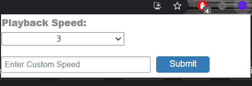

# Speed-Controller-Youtube
It is a chrome-extension that allows user to change the speed of youtube videos.

### Tech Stack: HTML,CSS,JavaScript.

1. Clone Repo or Download Zip.
2. Visit chrome://extensions/ and turn on "Developer mode".
3. Click "Load unpacked" button and navigate to the folder.

